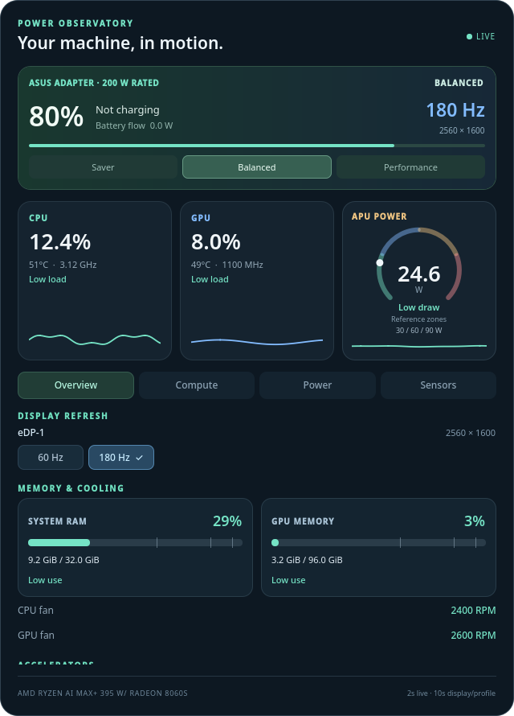

# Power Observatory

[](https://github.com/achagani/power-observatory/actions/workflows/ci.yml)
[](LICENSE)

**A live power and compute dashboard for KDE Plasma 6, with built-in power-profile and display refresh controls.**

Originally built for an ASUS ROG Flow Z13 with Ryzen AI MAX+ 395 / Radeon 8060S. AMD/ASUS telemetry is the tested path; unsupported sensors on other machines show as unavailable.



*Widget-only demo rendering. The values are illustrative synthetic data, not a hardware benchmark.*

## Features

- **Power source and battery:** battery/ASUS barrel/USB-C detection, battery flow, time remaining or time to full, energy, voltage, health, charge limit and cycles. Indicates when the battery supplements an adapter.
- **Power profile switcher:** Saver, Balanced and Performance buttons. Source-aware suggestions remain suggestions; changing chargers does not automatically change settings.
- **Discovered display refresh controls:** buttons for each connected, enabled display's available rates at its current resolution. Highlights the active mode, supports fractional rates and external screens, revalidates hotplug/resolution changes, and verifies the applied mode. On the tested panel, the choices are **60 Hz and 180 Hz**.
- **CPU:** live graph, logical-thread utilization, frequency, core power, temperature, EPP, governor, boost and load average.
- **GPU:** live utilization, user-session compute engine activity, media engine, GPU power/clocks, reserved UMA/VRAM and GTT allocations.
- **NPU:** AMD firmware activity by IPU column, power, frequency, memory traffic and runtime state.
- **Visual memory and power gauges:** matching RAM and GPU-memory capacity bars, labeled load levels, and APU/CPU/GPU/NPU/battery-discharge gauges with explicit reference thresholds.
- **Cooling and thermal limits:** fan RPM and per-sensor thermal bars; “Danger” appears only at a driver-reported critical temperature. Missing limits remain unclassified.
- **Native desktop widget:** dark QML dashboard, four scrollable detail views, live history and explicit stale/unavailable states. No telemetry upload or resident service.

## Install

Requirements:

- KDE Plasma **6**, with `kpackagetool6` and the Plasma5Support executable data engine.
- Python **3.10+**; no pip packages needed at runtime.
- `powerprofilesctl` with an available power-profiles-daemon for profile controls.
- `kscreen-doctor` for display discovery and refresh controls.

Download **Power-Observatory.plasmoid** from the [latest release](https://github.com/achagani/power-observatory/releases/latest), then run:

```bash
kpackagetool6 --type Plasma/Applet --install Power-Observatory.plasmoid
```

Right-click the desktop → **Add Widgets** → search **Power Observatory**. Move or resize it through desktop Edit Mode. The intended desktop size is about 640 × 896 logical pixels; it supports widths down to 480 pixels. Use one instance per session.

For updates:

```bash
kpackagetool6 --type Plasma/Applet --upgrade Power-Observatory.plasmoid
```

Open a fresh `plasmawindowed local.power.observatory` to test an update. If an existing desktop instance still shows old QML, log out/in to clear the shell's cached components.

To build from source:

```bash
git clone https://github.com/achagani/power-observatory.git
cd power-observatory
python3 scripts/build.py
kpackagetool6 --type Plasma/Applet --install dist/Power-Observatory.plasmoid
```

## Use the controls

**Power profiles:** click Saver, Balanced or Performance in the green power card. The highlighted value follows the actual daemon state. An unsuccessful change appears as an error in the details area.

**Screen refresh:** use **Display Refresh** at the top of Overview, or the Displays section of Power. Each screen gets its own buttons. The widget changes only that output's mode at its existing resolution. The selected rate gets a check mark after KScreen confirms it. It does not create custom modes or automatically change rates on battery.

Sensor values update every **2 seconds**; display/profile discovery updates every **10 seconds** and immediately after successful controls. Scroll within Compute, Power and Sensors to see the full details.

## Optional charger ratings

Charger type can be detected; nameplate wattage usually cannot. To label your own adapters, create `~/.config/power-observatory/settings.json` (or use `$XDG_CONFIG_HOME`):

```json
{
  "barrel_rated_watts": 200,
  "usb_rated_watts": 100
}
```

These are optional owner-supplied ratings. Without configuration the widget shows the charger type without an assumed wattage. A negotiated USB-C contract may be lower than the adapter rating. Neither value is measured wall consumption.

## Gauge colors and thresholds

Memory bars show **used / total**, percentage, and capacity pressure: low below 60%, moderate from 60%, high from 85%, near full from 95%. CPU/GPU load labels use 40/80/95% boundaries. These are display conventions, not safety limits.

Power gauges use **green low → blue moderate → amber high → red very high draw**. The three transition values appear below each gauge and in its tooltip. Defaults (watts):

| Gauge | Moderate starts | High starts | Very high starts |
| --- | ---: | ---: | ---: |
| APU chip total | 30 | 60 | 90 |
| CPU cores | 15 | 35 | 60 |
| GPU domain | 10 | 25 | 50 |
| NPU domain | 2 | 5 | 10 |
| Battery discharge | 15 | 30 | 45 |

These are configurable visualization references, **not manufacturer danger thresholds, enforced power limits, or charger headroom**. CPU/GPU/NPU domain powers are not extra loads to add to APU power. Battery discharge measures a different scope. Charging power is not graded against discharge thresholds.

To override any domain, add `power_bands_watts` to the same local settings file:

```json
{
  "barrel_rated_watts": 200,
  "usb_rated_watts": 100,
  "power_bands_watts": {
    "apu": [25, 50, 80],
    "battery": [12, 25, 40]
  }
}
```

Each override must contain three finite, positive, increasing watt values (up to 2000 W); invalid entries fall back per domain. Settings are read on the next sample. The gauge needle saturates at its scale endpoint; the numeric value remains untruncated.

Thermal bars use that sensor's own kernel `temp*_max` / `temp*_crit`. **Danger · critical** means the reading reaches the reported critical threshold; **High · over max** means it reaches the reported high limit. **Near critical** starts at 90% of the critical value. With no usable driver limit, the widget says **Limit unavailable** instead of inventing a safe/danger range. Missing or stale data receives no colored status.

## Measurement limits

- APU chip power, GPU/CPU domain power, battery flow and USB-C contracts are distinct. Total AC wall draw is not available.
- Battery time is an estimate using energy and a 30-second smoothed power flow; it adapts to workload. Zero/unknown flow produces no invented estimate.
- AMD's GPU “VRAM” can be firmware-reserved unified memory. Linux RAM excludes that reservation; GTT is not additional physical RAM.
- GPU compute covers readable processes belonging to your session. Parallel engines can exceed 100%. NPU “suspended” is a power state, not an activity percentage.
- The detailed AMD firmware decoder supports the **gpu_metrics v3.0 ABI**. Other revisions fall back to readable generic sensors; Intel/NVIDIA GPU backends are not implemented.
- Display rate is the configured mode, not instantaneous VRR. Only the first system battery is currently monitored. Multiple widget instances share sampling baselines.

Tested on Fedora KDE/Wayland with Ryzen AI MAX+ 395 / Radeon 8060S. Broader hardware support is welcome; see [architecture and source interfaces](docs/architecture.md).

## Troubleshooting

| Symptom | Check |
| --- | --- |
| Display modes unavailable | Run `kscreen-doctor -j` inside your Plasma session. Disconnected/disabled outputs are intentionally excluded. |
| Profile unavailable or rejected | Run `powerprofilesctl list`; check that power-profiles-daemon is available for your machine. |
| A sensor shows `—` | The driver did not expose a supported value. Valid zero readings display as zero. |
| Old interface after an upgrade | Test with a new `plasmawindowed` process, or log out/in. |
| Stale readings / collector error | Run `python3 ~/.local/share/plasma/plasmoids/local.power.observatory/contents/code/telemetry.py` in a terminal and inspect the error locally. |

Do not post unreviewed live dumps or full desktop screenshots in issues.

## Develop and contribute

[CONTRIBUTING.md](CONTRIBUTING.md) provides local setup, tests and the review workflow. [AGENTS.md](AGENTS.md) provides an explicit development contract for coding agents: architecture, invariants, validation commands and boundaries around live hardware changes. AI-assisted and human contributions follow the same checks.

```bash
python3 -m pip install -r requirements-dev.txt  # preferably inside a venv
python3 -m unittest discover -v
python3 tests/test_qml.py
python3 preview.py tests/fixtures/demo.json
python3 scripts/build.py
```

CI runs Python tests on 3.10/3.12/3.14, offscreen QML interaction checks and package builds. Synthetic fixtures make these checks independent of the contributor's hardware. Generated packages and UI previews are attached to CI runs.

[Report a bug or request support](https://github.com/achagani/power-observatory/issues/new/choose) · [MIT license](LICENSE)
